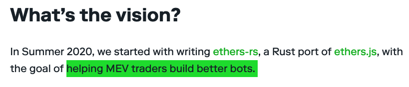
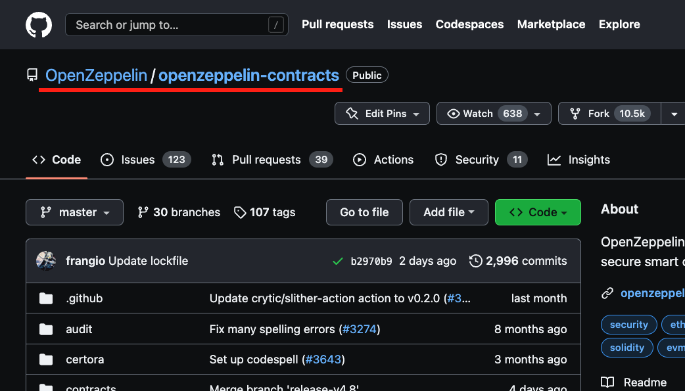
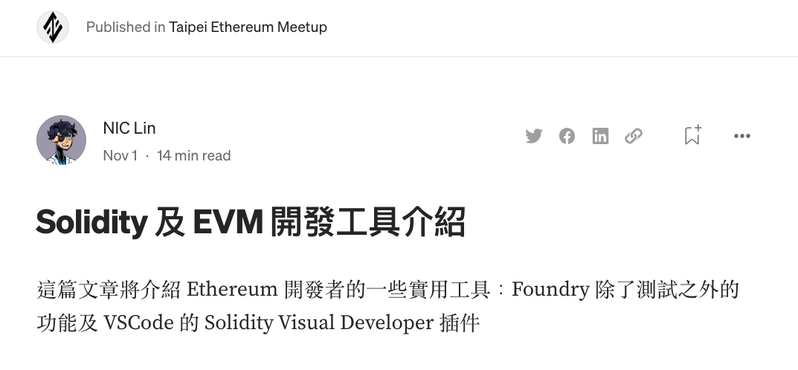

# Foundry Workshop


###### 2022/11/17

---

<!-- Scoped style -->
<style scoped>
section {
    padding-left: 140px;
}
</style>

# **Intro**

- **wiasliaw**
- FiO Blockchain Dev
- [Medium](https://medium.com/@wiasliaw)
- [LunDao](https://lundao.tech/)


---

<!-- Scoped style -->
<style scoped>
section {
    padding-left: 300px;
    padding-right: 300px;
}
</style>

# **Why Foundry**

- a portable, fast and modular toolkit
- rust reimplementation of **dapptools**

---

<!-- Scoped style -->
<style scoped>
section {
    padding-left: 200px;
    padding-right: 200px;
}
</style>

# Why Foundry (cont.)

- Tests in Solidity, not Javascript
    - lots of dependencies, configs and **node_modules**
    - missing typing
- Big Number libs
- Testing with level-1 abstraction
- Fuzz Test

---

<!-- Scoped style -->
<style scoped>
img {
    width: 100%;
}
</style>

# Why Foundry (cont.)



---

<!-- Scoped style -->
<style scoped>
section {
    padding-left: 200px;
    padding-right: 200px;
}
</style>

# **Installation**

- CLI: **forge**, **cast** and **anvil**
- windows: install Rust and build from source
- Linux/MacOS
    - build from source
    - use foundryup

---

<!-- Scoped style -->
<style scoped>
code {
    font-size: 30px
}
</style>

# foundryup

<br />

Need curl & git

```sh
$ sudo apt -y install curl git
$ curl -L https://foundry.paradigm.xyz | bash
```

```sh
$ foundryup
```

---

<!-- Scoped style -->
<style scoped>
section {
    padding-left: 300px;
    padding-right: 300px;
}
</style>

# **forge**

- compile, test, deploy contracts
- dependency management

---

## forge init

- init a repo with [default template](https://github.com/foundry-rs/forge-template)

```sh
$ forge init hello
$ npx tree-cli -l 2 
/home/parallels/Desktop/hello
├── foundry.toml
├── lib
|  └── forge-std
├── script
|  └── Counter.s.sol
├── src
|  └── Counter.sol
└── test
   └── Counter.t.sol
```

---

## forge install



---

## forge install/update/remove

```sh
$ forge install OpenZeppelin/openzeppelin-contracts --no-commit
$ forge update ./lib/openzeppelin-contracts
$ forge remove openzeppelin-contracts
```

```sh
$ npx tree-cli -l 2
/home/parallels/Desktop/hello
├── foundry.toml
├── lib
|  ├── forge-std
|  └── openzeppelin-contracts
```

---

## remappings

How Solidity compiler resolve import files.

---

### remapping hardhat

```
import "@openzeppelin/contracts/token/ERC20/ERC20.sol";

-> @openzeppelin -> node_modules/@openzeppelin/...
```

---

### remapping foundry

```sh
$ forge remappings > remappings.txt
```

remappings.txt
```txt
ds-test/=lib/forge-std/lib/ds-test/src/
forge-std/=lib/forge-std/src/
openzeppelin-contracts/=lib/openzeppelin-contracts/contracts/
```

import
```js
import "openzeppelin-contracts/token/ERC20/ERC20.sol";
```

---

## forge build & test

```sh
$ forge build
$ forge test
```

---

<!-- Scoped style -->
<style scoped>
section {
    padding-left: 300px;
    padding-right: 300px;
}
</style>

# **Testing**

- cheatcode
    - edit evm status for testing
    - assertion
- need to test
    - getter/setter
    - event/revert

---

<!-- Scoped style -->
<style scoped>
section {
    padding-left: 300px;
    padding-right: 300px;
}
</style>

## Cheatcode

- `warp`, `roll`, `deal`
- `startPrank`, `stopPrank`
- `assertEq`, `expectEmit`, `expectRevert`
- `assume`
- `startBroadcast`, `stopBroadcast`

---

## getter/setter - sample

contract

```javascript
contract Counter {
    uint256 public number;

    function setNumber(uint256 newNumber) public {
        number = newNumber;
    }

    function increment() public {
        number++;
    }
}
```

---

```js
// SPDX-License-Identifier: UNLICENSED
pragma solidity ^0.8.13;
import "forge-std/Test.sol";
import "../src/Counter.sol";
contract CounterTest is Test {
    Counter public counter;
    function setUp() public { // beforeEach
        counter = new Counter();
        counter.setNumber(0);
    }
    function testIncrement() public { // prefix testXXXX
        counter.increment();
        assertEq(counter.number(), 1);
    }
}
```

---

## event - sample

```js
import "forge-std/Test.sol";
contract TestERC20 is Test {
    MintableERC20 private _erc20;
    event Transfer(address indexed from, address indexed to, uint256 value);
    function setUp() public {
        _erc20 = new MintableERC20();
    }
    function testMint() public {
        vm.expectEmit(true, true, true, true);
        emit Transfer(address(0), address(this), 1000);
        _erc20.mint(1000);
    }
}
```

---

# revert - sample

- `other`'s allowance == 0
- reason string is `ERC20: insufficient allowance`

```js
function testShouldRevert() public {
    _erc20.mint(1000);
    address other = vm.addr(1);
    vm.startPrank(other);
    vm.expectRevert("ERC20: insufficient allowance");
    _erc20.transferFrom(address(this), other, 1000);
    vm.stopPrank();
}
```

---

## Fuzz Test

- Property-based Test
    - 一個測試代表著對該測試對象的證明。因此，一個 property 可視為該測試對象的「標準」（invariants）或是「規格」（specification）
    - 測資不應該是手刻，要以自動產生的方式來尋找 edge case

舉例：一個 transfer erc20 的 function，測試的 property 就是「給定一個安全的值，從某個帳號轉帳給另一個帳號」

---

## Fuzz Test - example

sample
```js
// SPDX-License-Identifier: UNLICENSED
pragma solidity ^0.8.13;
import "openzeppelin-contracts/token/ERC20/utils/SafeERC20.sol";
contract SafePayment {
    address private _erc20;
    constructor(address erc20) {
        _erc20 = erc20;
    }
    function payment(address from, address to, uint256 value) external {
        SafeERC20.safeTransferFrom(IERC20(_erc20), from, to, value);
    }
}
```

---

```js
import "../src/ERC20_Payment.sol";
contract TestPayment is Test {
    MintableERC20 private _token;
    SafePayment private _payment;
    function setUp() public {
        _token = new MintableERC20();
        _payment = new SafePayment(address(_token));
    }
    function testFuzzPayment(
        address from, address to, uint256 amount
    ) public {
        vm.startPrank(from);
        _token.mint(amount);
        _token.approve(to, amount);
        vm.stopPrank();

        vm.startPrank(to);
        _payment.payment(from, to, amount);
        vm.stopPrank();
    }
}
```

---

fix bugs: clear invalid input

```js
function testFuzzPayment(
    address from, address to, uint256 amount
) public {
    vm.assume(from != address(0));
    vm.assume(to != address(0));
    vm.startPrank(from);
    _token.mint(amount);
    _token.approve(address(_payment), amount);
    vm.stopPrank();

    vm.startPrank(to);
    _payment.payment(from, to, amount);
    vm.stopPrank();
}
```

---

<!-- Scoped style -->
<style scoped>
section {
    padding-left: 300px;
    padding-right: 300px;
}
</style>

# **Deployment**

- deployment
- verification

---

## forge create

```sh
$ forge create <PATH>:<CONTRACT_NAME>
```

example
```sh
forge create \
    --rpc-url <url> \
    --private-key <key> \
    src/Simple.sol:Simple \
    --constructor-args "My Token" "MT" \
    --etherscan-api-key <key> \
    --verify
```

---

## forge verify-contract

```sh
forge verify-concompiler-version "v0.8.11+commit.d7f03943" \
  <Address> <Path>:<Contract>
```

---

# **Script**

Using Solidity write script.

---

example

```js
// SPDX-License-Identifier: UNLICENSED
pragma solidity ^0.8.13;
import "forge-std/Script.sol";
import "openzeppelin-contracts/token/ERC721/ERC721.sol";
contract ERC721Deployment is Script {
    // default sig
    // load .env by default
    function run() external {
        uint256 deployerPrivateKey = vm.envUint("PRIVATE_KEY");
        vm.startBroadcast(deployerPrivateKey);
        ERC721 nft = new ERC721("Hello", "World");
        vm.stopBroadcast();
    }
}
```

---

```sh
$ forge script ./script/ERC721Deployment.script.sol \
  [--broadcast] \
  [--verify]
```

---

<!-- Scoped style -->
<style scoped>
section {
    padding-left: 300px;
    padding-right: 300px;
}
</style>

# **misc**

- `cast`: cli utils like ethers-js
- `anvil`: local node development

---

# **Recommendation**

[](https://medium.com/taipei-ethereum-meetup/tools-for-debugging-solidity-and-evm-interaction-285f2bfb9c17)

---

# Reference

- [Introducing the Foundry Ethereum development toolbox](https://www.paradigm.xyz/2021/12/introducing-the-foundry-ethereum-development-toolbox)
- [foundry docs](https://book.getfoundry.sh/)
- [dapptools github](https://github.com/dapphub/dapptools)
- [cybai - introduction-to-property-based-testing-at-coscup-2022](https://speakerdeck.com/cybai/introduction-to-property-based-testing-at-coscup-2022)
